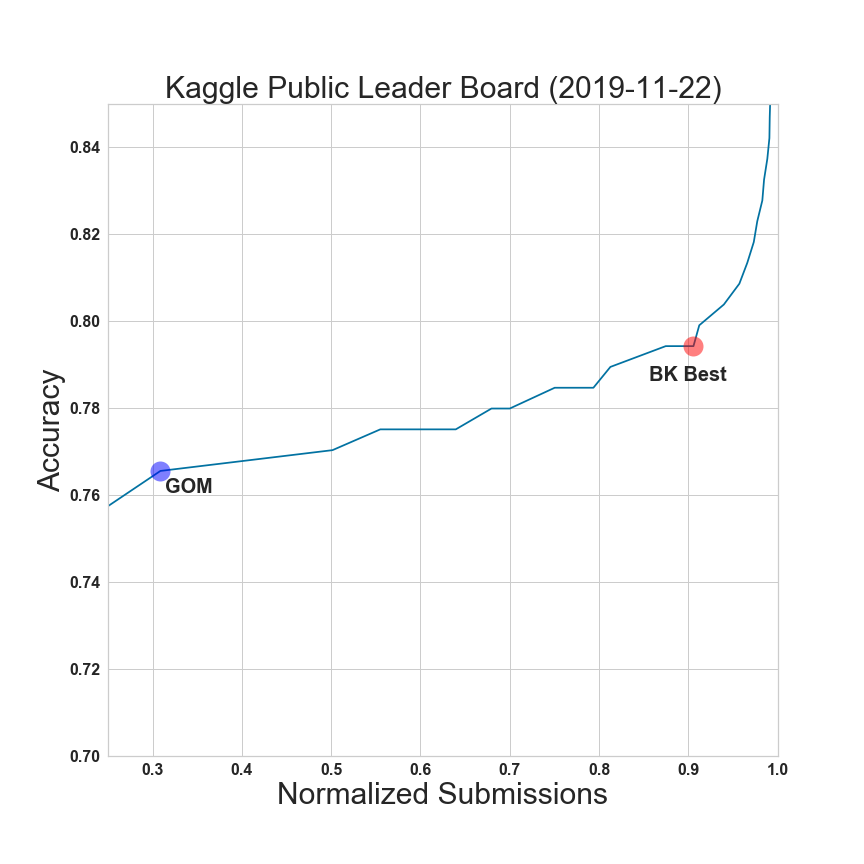

Executive Summary
=================

`Titanic: Machine Learning from Disaster <https://www.kaggle.com/c/titanic/overview>`_

**Goal**
    Create a machine learning model that predicts which passengers
    survived the Titanic shipwreck.

    A model will be determined successful if it can achieve an 0.82
    accuracy or greater rating on the Holdout Kaggle Competition data
    set.

**Best Model**
    Logistic Regression
        Test Accuracy           = 0.8384
        Kaggle Holdout Accuracy = 0.7943

**Current Status**
    :ref:`log-current-status`

Model Scorecard
---------------

.. csv-table::
   :file: ./_tables/model_accuracy.csv
   :header-rows: 1
   :widths: 8, 20, 20, 20,20, 10, 30

NS = Not Submitted

Kaggle Public Leader Board
--------------------------

|public_leader_board|