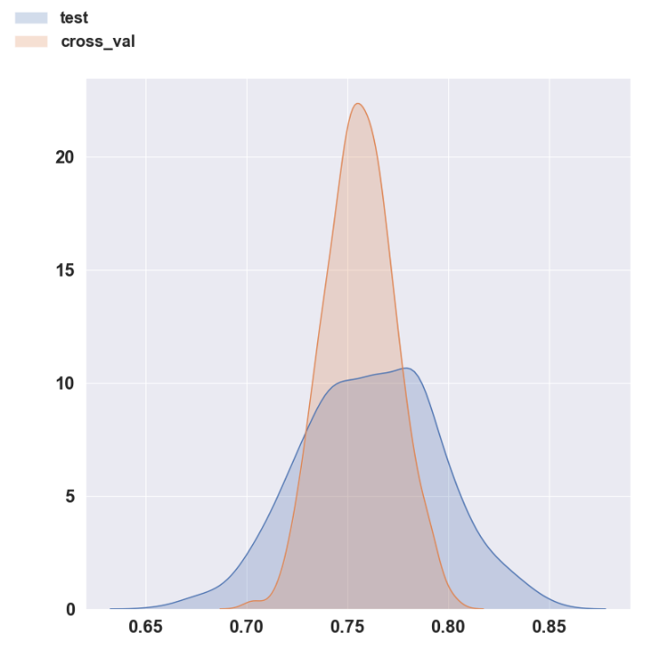

Log
===

Oct 16, 2019 at 8:31:52 PM
--------------------------
* Created project from Cookie Cutter.
* Downloaded data
* Ran Great Expectations Profiler.

Oct 17, 2019 at 12:52:51 PM
---------------------------

**Situation**
    First model needs to be built and tested.

**Background**
    The function for measuring the accuracy of the model was created.

**Assessment**
    The logistic regression used a very simple model. Better models
    with the same data may be able to improve the accuracy.  RandomForest
    decision trees may be a better approach as a classification problem.

**Recommendation**
    Try Logistic Regression with age as a feature.

Oct 17, 2019 at 2:30:03 PM
---------------------------

**Situation**
    Completed first model with simple Logistic Regression.  The model
    achieved an accuracy of 80%.

**Background**
    First model did not use age, name, and pclass in the models.

**Assessment**
    Age is known for 80% of the participants. Include age in the model. When
    age is NaN fill with the mean age of all the passengers.

    Logistic Regression with Age did not change the accuracy of the model.

**Recommendation**
    Try Normalizing the features before fitting.

.. _log-current-status:

Oct 28, 2019 at 9:35:23 AM
--------------------------

    Documentation of this project needs updating and cleaning. This will be the
    first task today.

    Things that need attention:
    * Autodoc is not included in the Sphinx documentation.
    * Default Spinx theme should be replaced with Read The Docs theme.
    https://sphinx-rtd-theme.readthedocs.io/en/stable/

**Situation**
    I am able to achieve a 0.8384 accuracy score on the test data set. However,
    when I calculate the accuracy on the Kaggle Holdout data my score drops to
    0.79425.  WHY?

**Background**
    The Gender Only model produces a Holdout Accuracy score of 0.76555. The
    logreg_model_3 uses only 5 parameters ('title_Mr', 'title_Mrs',
    'family_size', 'is_child', 'pclass').  Reducing the number of features
    allowed the Kaggle Holdout Score to increase.

**Assessment**
    At this point, I believe we are reaching the point of diminishing returns
    with Logistic regression. From two perspectives,

    #. I don't believe the Kaggle Holdout accuracy score will increase
    that much. Others have reported higher accuracy scores but for
    they are reporting cross validation accuracy scores.

    #. I am limiting what I can learn by not using other models.

**Recommendation**
    I recommend exploring the use of Decision Trees for the Kaggle competition.

Nov 5, 2019 at 10:48:56 AM
--------------------------

I am returning to this project after a hiatus. Current accuracy with Logistic
Regression is **0.8384** but only 0.79425.  I am going to switch to Decision
Trees.

I created two simple decision tree models. The first one used the same features
as logistical regression model 3.  The second one selected features as
suggested by YellowBrick. Both models had an accuracy less than logreg_model_3.

I also came across a model a web page the discussed how to use Decision Trees
in scikit-learn by Ben Keen.

http://benalexkeen.com/decision-tree-classifier-in-python-using-scikit-learn/

While I was working on Decision Trees I noticed that the predicted accuracy
score is much lower than the Cross Validated Accuracy score for the Titanic
data set.

    DecisionTreeClassifier(class_weight=None, criterion='gini', max_depth=None,
                           max_features=None, max_leaf_nodes=None,
                           min_impurity_decrease=0.0, min_impurity_split=1e-07,
                           min_samples_leaf=1, min_samples_split=2,
                           min_weight_fraction_leaf=0.0, presort=False,
                           random_state=1, splitter='best')

    Accuracy Score on X_test,y_test:  0.8182

    Cross Validation Scores:
    	* Accuracy 	: 0.7407 (+/- 0.0664)
    	* Recall		: 0.7078 (+/- 0.2161)
    	* Precision	: 0.6726 (+/- 0.0548)
    	* F1		: 0.6864 (+/- 0.1197)

I don't know why this happens. Is it possible that the distributions of the
Train, Test, and Holdout data sets are different? Great Expectations may
be helpful in sorting this out.

Another possibility is the imbalance of the the training data. I
rebalanced the data set by undersampling.  This did not solve the
problem.

Nov 6, 2019 at 11:35:47 AM
--------------------------

Yesterday I observed that the accuracy from the test data set always had a
larger variance than the cross validation accuracy.  I didn't understand
why this would be the case and wanted to explore this further.  Here is an
example of the distribution and code.

.. code-block:: python
    :linenos:

    def check_accuracy_by_random_sampling(X,y):

        accuracy = []
        n_random=1000
        RANDOM_STATE_RANGE = list(range(0,n_random,1))
        len(RANDOM_STATE_RANGE)
        verbose = False

        pbar = ProgressBar(maxval=n_random).start()

        for i, random_state in enumerate(RANDOM_STATE_RANGE, start=0):

            X_train, X_test, y_train, y_test = train_test_split(X,
                                                                y,
                                                                test_size=0.2,
                                                                random_state=random_state)

            model = DecisionTreeClassifier(class_weight=None, criterion='gini', max_depth=None,
                            max_features=None, max_leaf_nodes=None,
                            min_impurity_split=1e-07, min_samples_leaf=1,
                            min_samples_split=2, min_weight_fraction_leaf=0.0,
                            presort=False, random_state=random_state, splitter='best');

            _ = model.fit(X_train, y_train);

            (ii_y_pred,
             ii_predicted_accuracy_score,
             ii_cv_scores ) = pm.calc_model_rst_table_metrics(model, X_train, y_train, X_test, y_test,
                                                              model_name='dtree_reference', cv=5, verbose=verbose)

            accuracy.append( [random_state,
                                  ii_predicted_accuracy_score,
                                  np.mean(ii_cv_scores['test_accuracy']),
                                  np.std(ii_cv_scores['test_accuracy'])])

            pbar.update(i)

        pbar.finish()

        return np.array(accuracy)

    accuracy = check_accuracy_by_random_sampling(X,y)

    Histogram of the test accuracy and the 5 fold cross validation accuracy.  You
    will notice that the standard deviation of the cross validation accuracy is
    much smaller than the test accuracy.

The reason why the standard deviation of the cross validation accuracy is
smaller than the standard deviation of the test accuracy is because the cross
validation accuracy is an average across all the folds.  This averaging is the
reason for the smaller spread in values.

Nov 6, 2019 at 1:58:42 PM
-------------------------

I have been unable to improve the accuracy with basic decision trees.  I am
going to try to use XGBoost.

Nov 7, 2019 at 9:49:42 AM
-------------------------

I still have been unable to improve my accuracy with XGBoost.  I am going to
try three things based upon a kernal from Leonardo Ferreira.

https://www.kaggle.com/kabure/titanic-eda-model-pipeline-keras-nn

1. Update the Titles to be a litte more descriptive. The Titles have been
set to Mr. and Mrs.  This is based upon sex and age.  However, the Titles are
more descriptive than this.  For example, we can specify crew members.  I am
going to reassign the titles according to the suggestions of Leonardo Ferreira.

.. code-block:: python

    Title_Dictionary = {
            "Capt":       "Officer",
            "Col":        "Officer",
            "Major":      "Officer",
            "Dr":         "Officer",
            "Rev":        "Officer",
            "Jonkheer":   "Royalty",
            "Don":        "Royalty",
            "Sir" :       "Royalty",
            "the Countess":"Royalty",
            "Dona":       "Royalty",
            "Lady" :      "Royalty",
            "Mme":        "Mrs",
            "Ms":         "Mrs",
            "Mrs" :       "Mrs",
            "Mlle":       "Miss",
            "Miss" :      "Miss",
            "Mr" :        "Mr",
            "Master" :    "Master"
                    }

2. For the previous models, I have used the numeric value of the age.  I am
going to bin the age according to these categories.

.. code-block:: python

    age_bins = (0, 5, 12, 18, 25, 35, 60, 120)
    age_bin_label =   ['baby','child','teen','student','young_adult','adult','senior']

3. For the previous models, I have used the Fare as a numeric value.  I am
going to split the Fare into quartiles.  I split the Fare into quartiles with
pd.qcut() on the training data set and then applied the same binning ranges to
the holdout data using pd.cut().

I have implemented all three of these new features and my Kaggle Public score
dropped to 0.7790.

Nov 11, 2019 at 9:53:39 AM
--------------------------

I noticed that there were 15 passengers with a fare of 0. Since it is unlikely
that passengers travelled on the Titanic for free, I will assume that these 0
fares are based upon missing information.  Passengers traveling with a fare
equal to 0 will be replaced with the median fare for that pclass.

I have updated the TransformedData and rerun the transformed data for

    train.csv
    holdout.csv.

This data is now in

    '../data/processed/train_v3.csv'
    '../data/processed/holdout_v3.csv'

I learned some interesting things today.  I submitted several more models to
Kaggle website.  I still haven't been able to beat logreg_model_3.  I was able
to reproduce the the score to Kaggle with logreg_model_3 with the old model.
The old model used pclass as a numerical data set. I fixed that and resubmitted
the predictions with the following model:

    Features:
        Index(['title_Mr', 'title_Mrs', 'family_size', 'is_child', 'pclass_2',
        'pclass_3'], dtype='object')

    Model:
        LogisticRegression(C=1.0, class_weight=None, dual=False, fit_intercept=True,
                   intercept_scaling=1, l1_ratio=1, max_iter=500,
                   multi_class='warn', n_jobs=None, penalty='l2',
                   random_state=42, solver='warn', tol=0.0001, verbose=0,
                   warm_start=False)

    Accuracy:
        Accuracy Score on X_test,y_test:  0.7989

    Cross Validation Scores:
	    * Accuracy 	: 0.8301 (+/- 0.0332)
	    * Recall		: 0.7201 (+/- 0.0546)
	    * Precision	: 0.8079 (+/- 0.0526)
	    * F1		    : 0.7612 (+/- 0.0477)

    11/11/19, logreg_model_3_resubmit.csv,  0.77511, 0.8301, 0.7201,0.8079,0.7612

The score dropped from the first submission. The only major difference is the
processed data used. In the first submission, I used the transformed and
holdout data sets **_v1.csv**.  In the new data set I used **_v3.csv**.  The
difference between the two data sets is I cleaned up the Title transformations,
fixed the age and fare ranges to match what is provided online. The age and
fare data columns are not used in the logreg model. The title is used. I
suspect that the inclusion of more titles (Officer, Royalty) is
making the model less generic.

Nov 12, 2019 at 9:56:26 am
--------------------------

I have installed the Kaggle API. You should now be able to upload a submission
using the Kaggle API. Here is an example,

kaggle competitions submit favorita-grocery-sales-forecasting -f sample_submission_favorita.csv.7z -m "My submission message"

Nov 18, 2019 at 1:08:38 PM
--------------------------

The documentation and models in this project have become unmanageable.  It needs
to be cleaned up so that it is easy to understand what models have been created.
For this reason,  I am going to delete notebooks associated with models that
are not the top modesl from each category.  Models that will be retained are

date,     model,                    holdout_accuracy, accuracy, recall,     precision, f1
10/28/19, dummy_most_frequent,      NS,               0.6223,   ,           ,
10/28/19, logreg_gender_only,       0.76555,          0.7958,   0.6959,     0.7455,     0.7189
10/28/19, logreg model_3,           0.79425,          0.8384,   0.7162,     0.8306,     0.7691
11/05/19, dtree_model_2,            0.78468,          0.8272,   0.7012,     0.8143,     0.7516
11/07/19, xgb_3,                    0.77990,          0.8329,   0.6939,     0.8357,     0.7572

Old preprocessed data will also be removed.  json files will be created to provide information
about the preprocessed data and the Kaggle submissions. All models will be retested with a
new Kaggle submission using the command line interface.

Nov 22, 2019 at 8:16:31 am
--------------------------

Kaggle Titanic refactor day is today.

1) Refactor models so only on version of each model is in repository
2) Create Unit tests
3) Measure code complexity
4) Optimize Hyperparameters with HyperOpt
5) Validate data with Great Expectations

Nov 22, 2019 at 8:16:31 am
--------------------------

I cleaned up the Logistic Regression model by deleting all models except the
model with the highest accuracy and fewest features.  Ths allowed me to achieve

date,     model,        holdout_accuracy, accuracy, recall,  precision,  f1
10/28/19, logreg model, 0.79425,          0.8384,   0.7162,  0.8306,     0.7691

I optimized the Logisitic Regression model with HyperOpt but this did not change
the holdout accuracy.

Nov 22, 2019 at 3:52:42 PM
--------------------------
Here is the XGB Classifier model

XGBClassifier(base_score=0.5, booster='gbtree', colsample_bylevel=1,
              colsample_bynode=1, colsample_bytree=0.3, gamma=0,
              learning_rate=0.01, max_delta_step=0, max_depth=4,
              max_features='sqrt', min_child_weight=1, missing=None,
              n_estimators=1000, n_jobs=1, nthread=None,
              objective='binary:logistic', random_state=42, reg_alpha=0,
              reg_lambda=1, scale_pos_weight=1, seed=123, silent=None,
              subsample=0.3, verbosity=1)

Index(['is_child', 'fare_bin_q4', 'age_bin_baby', 'title_Miss', 'family_size',
       'pclass_3', 'title_Mrs', 'title_Mr'],
       dtype='object')

Nov 22, 2019 at 3:53:03 pm
--------------------------

Remove Decision Tree models from documentation

Dec 4, 2019 at 1:25:18 PM
-------------------------

Created src/models/run.py so saved models can be run from the command line.  For example,

    >> cdkt
    >> cd data/processed
    >> ../../src/models/run.py ../../models/xgb.joblib X_test__xgb.csv -y y_test__xgb.csv -v -o kaggle_test_xgb_model.csv
    >> ../../src/models/run.py ../../models/logreg.joblib X_test__logres.csv -y y_test__logres.csv -v -o kaggle_test_logres_model.csv

Updated documentation to include this new information.  

